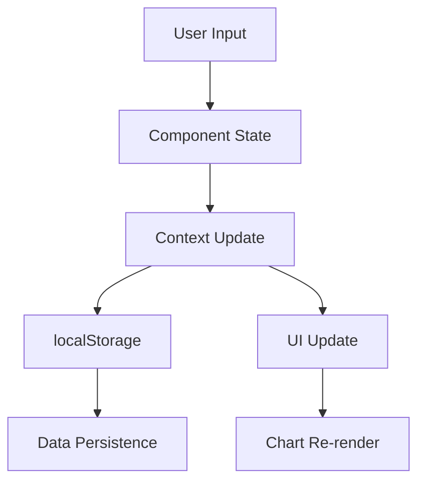

# 🏦 Budgy - Smart Financial Management

[](https://nextjs.org/)
[](https://reactjs.org/)
[](https://www.chartjs.org/)
[](https://tailwindcss.com/)

> Your ultimate budget planner and financial advisor. Track expenses, set goals, and achieve financial freedom with expert guidance.

## 📋 Table of Contents

- [Overview](#-overview)
- [✨ Features](#-features)
- [🚀 Quick Start](#-quick-start)
- [📦 Installation](#-installation)
- [🔧 Development](#-development)
- [🏗️ Architecture](#️-architecture)
- [📱 Usage Guide](#-usage-guide)

- [📦 Deployment](#-deployment)
- [🤝 Contributing](#-contributing)
- [📄 License](#-license)

## 🎯 Overview

Budgy is a comprehensive personal finance management application built with Next.js 15 and React 19. It provides users with powerful tools to track income, manage expenses, set budgets, and visualize their financial health through interactive charts and analytics.

### Key Highlights

- **Modern Tech Stack**: Built with Next.js 15 App Router and React 19
- **Real-time Analytics**: Interactive charts powered by Chart.js
- **Responsive Design**: Mobile-first approach with Tailwind CSS
- **Local Storage**: Client-side data persistence
- **Budget Alerts**: Smart notifications for budget tracking
- **Recurring Expenses**: Automated expense management

## ✨ Features

### 💰 Core Financial Management
- **Transaction Tracking**: Add, edit, and categorize income/expenses
- **Category Management**: Custom categories with icons and colors
- **Budget Setting**: Monthly budgets per category with alerts
- **Financial Summary**: Real-time balance, income, and expense calculations

### 📊 Analytics & Visualization
- **Income vs Expense Charts**: Bar charts showing financial overview
- **Category Breakdown**: Doughnut charts for expense categorization
- **Real-time Updates**: Charts update automatically with new data
- **Responsive Charts**: Optimized for all device sizes

### 🔔 Smart Notifications
- **Budget Alerts**: Warning when approaching budget limits (80%+)
- **Over-budget Notifications**: Alerts when exceeding budget (100%+)
- **Visual Indicators**: Color-coded alerts with progress bars
- **Dismissible Alerts**: User-controlled notification management

### 🔄 Recurring Expenses
- **Automated Tracking**: Set up recurring expenses with frequencies
- **Auto-addition**: Automatic transaction creation when due
- **Manual Override**: Option to manually add recurring expenses
- **Upcoming Alerts**: 7-day preview of upcoming expenses

### 👤 User Management
- **User Authentication**: Sign up, login, and logout functionality
- **Session Management**: Persistent login sessions
- **Route Protection**: Secure dashboard access
- **User Data**: Personalized financial tracking

### 📱 Responsive Design
- **Mobile-First**: Optimized for smartphones and tablets
- **Desktop Experience**: Full-featured desktop interface
- **Touch-Friendly**: Optimized touch interactions
- **Cross-Platform**: Works on all modern browsers

## 🚀 Quick Start

### Prerequisites

- Node.js 18.0.0 or higher
- npm, yarn, or pnpm package manager
- Modern web browser

### One-Click Setup

```bash
# Clone the repository
git clone https://github.com/yourusername/budgy.git
cd budgy

# Install dependencies
npm install

# Start development server
npm run dev
```

Open [http://localhost:3000](http://localhost:3000) to view the application.

## 📦 Installation

### Step 1: Clone the Repository

```bash
git clone https://github.com/yourusername/budgy.git
cd budgy
```

### Step 2: Install Dependencies

```bash
# Using npm
npm install

# Using yarn
yarn install

# Using pnpm
pnpm install
```

### Step 3: Environment Setup

Create a `.env.local` file in the root directory:

```env
# Application
NEXT_PUBLIC_APP_NAME=Budgy
NEXT_PUBLIC_APP_URL=http://localhost:3000

# Analytics (Optional)
NEXT_PUBLIC_GA_ID=your-google-analytics-id

# External APIs (Future use)
NEXT_PUBLIC_API_URL=your-api-url
```

### Step 4: Start Development Server

```bash
npm run dev
```

The application will be available at `http://localhost:3000`.

## 🔧 Development

### Available Scripts

```bash
# Development
npm run dev          # Start development server
npm run build        # Build for production
npm run start        # Start production server
npm run lint         # Run ESLint
npm run lint:fix     # Fix ESLint errors

# Testing (Future)
npm run test         # Run unit tests
npm run test:watch   # Run tests in watch mode
npm run test:coverage # Generate coverage report
```

### Project Structure

```
budgy/
├── app/                          # Next.js App Router
│   ├── components/               # Reusable components
│   │   ├── dashboard/           # Dashboard-specific components
│   │   │   ├── BudgetAlerts.js
│   │   │   ├── BudgetOverview.js
│   │   │   ├── CategoryManager.js
│   │   │   ├── ChartCard.js
│   │   │   ├── RecurringExpenses.js
│   │   │   ├── TransactionForm.js
│   │   │   └── TransactionList.js
│   │   ├── navbar.js            # Navigation component
│   │   ├── footer.js            # Footer component
│   │   └── ...                  # Other UI components
│   ├── context/                 # React Context providers
│   │   ├── Authcontext.js       # Authentication context
│   │   └── BudgetContext.js     # Budget management context
│   ├── dashboard/               # Dashboard page
│   │   └── page.js
│   ├── login/                   # Login page
│   │   └── page.js
│   ├── signup/                  # Signup page
│   │   └── page.js
│   ├── about/                   # About page
│   │   └── page.js
│   ├── globals.css              # Global styles
│   ├── layout.js                # Root layout
│   └── page.js                  # Home page
├── public/                      # Static assets
│   ├── icon-budgy.png
│   └── ...
├── next.config.mjs              # Next.js configuration
├── package.json                 # Dependencies and scripts
└── README.md                    # This file
```

### Key Technologies

| Technology | Version | Purpose |
|------------|---------|---------|
| Next.js | 15.4.2 | React framework with App Router |
| React | 19.0.0 | UI library |
| Chart.js | 4.5.0 | Data visualization |
| react-chartjs-2 | 5.3.0 | React wrapper for Chart.js |
| Tailwind CSS | 4.0.0 | Utility-first CSS framework |

## 🏗️ Architecture

### State Management

The application uses React Context API for state management:

#### AuthContext
- **Purpose**: User authentication and session management
- **Features**: Login, logout, signup, route protection
- **Storage**: localStorage for session persistence

#### BudgetContext
- **Purpose**: Financial data and budget management
- **Features**: Categories, budgets, recurring expenses, alerts
- **Storage**: localStorage for data persistence

### Data Flow



### Component Architecture

- **Presentational Components**: UI-only components (ChartCard, TransactionList)
- **Container Components**: Business logic components (Dashboard, TransactionForm)
- **Context Providers**: State management (AuthProvider, BudgetProvider)

## 📱 Usage Guide

### Getting Started

1. **Create Account**: Sign up with email and password
2. **Add Categories**: Create custom expense categories
3. **Set Budgets**: Define monthly budgets for each category
4. **Track Transactions**: Add income and expenses
5. **Monitor Progress**: View charts and alerts

### Dashboard Features

#### Transaction Management
- **Add Transaction**: Use the transaction form to add income/expenses
- **Edit Transaction**: Click edit button to modify existing transactions
- **Delete Transaction**: Remove transactions with confirmation
- **Category Assignment**: Assign expenses to categories

#### Budget Management
- **Set Budgets**: Define monthly budgets per category
- **Track Progress**: Monitor spending against budgets
- **Receive Alerts**: Get notified when approaching limits

#### Analytics
- **Income vs Expense**: Bar chart showing financial overview
- **Category Breakdown**: Doughnut chart for expense analysis
- **Real-time Updates**: Charts update automatically

#### Recurring Expenses
- **Add Recurring**: Set up automatic recurring expenses
- **Frequency Options**: Weekly, monthly, yearly
- **Auto-addition**: Automatic transaction creation
- **Manual Override**: Option to manually add expenses

### Mobile Experience

The application is fully responsive with:
- **Touch-friendly**: Optimized for mobile interactions
- **Hamburger Menu**: Collapsible navigation
- **Responsive Charts**: Charts adapt to screen size
- **Mobile Forms**: Optimized form layouts

## 🔒 Security

### Current Implementation

- **Client-side Authentication**: Basic authentication with localStorage
- **Route Protection**: Dashboard access requires authentication
- **Input Validation**: Form validation and sanitization
- **Error Handling**: Graceful error handling and user feedback

### Production Security Recommendations

```javascript
// Implement JWT tokens
const token = jwt.sign({ userId: user.id }, process.env.JWT_SECRET);

// Add HTTPS enforcement
if (process.env.NODE_ENV === 'production') {
  app.use(helmet());
  app.use(forceHTTPS);
}

// Implement rate limiting
const rateLimit = require('express-rate-limit');
app.use('/api/', rateLimit({
  windowMs: 15 * 60 * 1000, // 15 minutes
  max: 100 // limit each IP to 100 requests per windowMs
}));
```

### Security Checklist

- [ ] Implement JWT authentication
- [ ] Add HTTPS enforcement
- [ ] Implement rate limiting
- [ ] Add input sanitization
- [ ] Set up CORS policies
- [ ] Implement 2FA (optional)
- [ ] Add audit logging
- [ ] Regular security updates


## 📦 Deployment

### Vercel Deployment (Recommended)

1. **Connect Repository**: Link your GitHub repository to Vercel
2. **Configure Build**: Vercel auto-detects Next.js configuration
3. **Environment Variables**: Add production environment variables
4. **Deploy**: Automatic deployment on push to main branch

```bash
# Install Vercel CLI
npm i -g vercel

# Deploy to Vercel
vercel --prod
```


### Performance Optimization

```javascript
// next.config.mjs
const nextConfig = {
  images: {
    domains: ['images.pexels.com'],
    formats: ['image/webp', 'image/avif'],
  },
  experimental: {
    optimizeCss: true,
  },
  compress: true,
  poweredByHeader: false,
};
```

## 🤝 Contributing

We welcome contributions! Please read our contributing guidelines.

### Development Setup

1. Fork the repository
2. Create a feature branch: `git checkout -b feature/amazing-feature`
3. Commit changes: `git commit -m 'Add amazing feature'`
4. Push to branch: `git push origin feature/amazing-feature`
5. Open a Pull Request


### Pull Request Guidelines

- Provide clear description of changes
- Include screenshots for UI changes
- Add tests for new functionality
- Update documentation as needed

## 📄 License

This project is licensed under the MIT License - see the [LICENSE](LICENSE) file for details.

## 🙏 Acknowledgments

- [Next.js](https://nextjs.org/) - React framework
- [Chart.js](https://www.chartjs.org/) - Data visualization
- [Tailwind CSS](https://tailwindcss.com/) - CSS framework
- [React](https://reactjs.org/) - UI library

## 📞 Support

- **Documentation**: [Wiki](https://github.com/yourusername/budgy/wiki)
- **Issues**: [GitHub Issues](https://github.com/yourusername/budgy/issues)
- **Discussions**: [GitHub Discussions](https://github.com/yourusername/budgy/discussions)
- **Email**: support@budgy.com

---

**Made with ❤️ by the Budgy Team**
